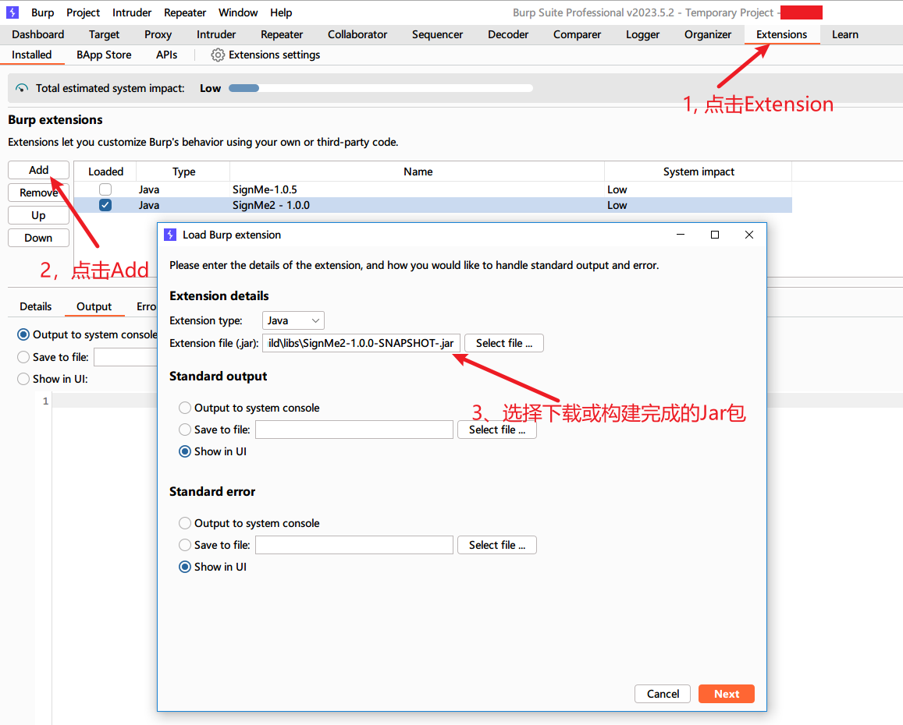

# SignMe2
> 快速编写各种签名算法的 burp 插件！

## 1. 介绍
SignMe2 是一款 Burp 插件，设计初衷是为了方便用户专注于各种安全测试，而不用关心各种签名算法的编程细节。用户可以使用 Javascript 编写签名算法，在 Burp 发起请求时自动计算签名值并对参数进行修改，为安全测试提供便利。

详细介绍：[https://lightless.me/archives/burp-sign-me.html](https://lightless.me/archives/burp-sign-me.html)

> 为什么是 SignMe2？ SignMe1 去哪里了？
> 
> SignMe1 是很久以前自己做安全测试时开发的小工具，由于是个人使用，所以代码非常混乱，且逻辑不清。
> 趁此机会重构了部分代码，由于与之前存在一些不兼容的修改，所以重新命名为 SignMe2。

## 2. 如何获取插件？
**方法1：从Release 页面下载预构建的 JAR 包**

最新 release 版本下载：`https://github.com/lightless233/sign-me-2/releases/latest`

历史版本下载：`https://github.com/lightless233/sign-me-2/releases`

**方法2：手工构建**

构建需求：
```plain
JDK 11 及以上 （理论上 JDK 1.8 及以上即可，但是未在 JDK 1.8 上进行测试）
NodeJS 18 及以上
PNPM
```

构建命令：
```plain
git clone https://github.com/lightless233/sign-me-2.git
cd sign-me-2/fe && pnpm i && cd ..

# 如果使用 MACOS、Linux
./gradlew shadowJar -PRELEASE

# 如果使用 Windows
./gradlew.bat shadowJar -PRELEASE
```
构建完成后可以在 `build/libs/` 中找到构建产物。

## 3. 如何使用？
如下图所示，在 Burp 中加载该插件。

加载完成后，在浏览器中访问：`http://localhost:3336/` 即可打开配置页面。

## 4. 插件工作原理
插件首先会根据当前启用的签名规则，过滤出符合条件的数据包。
针对每一个数据包，插件会自动调用签名算法中的 `main` 方法，并根据该方法的返回值，进一步决定如何修改当前数据包。

一个简单的例子：
```js
function main() {
    const sign = "hello sign me!";
    log(sign);
    return [
        {name: "sign", value: utils.md5(sign), location: ParameterType.HEADER, action: EditAction.OVERRIDE}
    ];
}
```

最后的返回值表明了需要在当前数据包的 HTTP 头中覆盖一个参数 `sign: hello sign me`。
用户需要做的，就是根据实际情况从目标网站上扒出签名算法，并指定如何处理这些 HTTP 数据包。
> 大部分情况下，网站的签名算法都在 JS 里，很多时候把算法复制过来修改一下就可以使用了。

### 使用当前 HTTP 请求中的数据
SignMe2 预先已经将当前 HTTP 数据包中的内容注入到了 JS 代码中，可以直接通过 `request` 变量获取使用，该变量及其内容为只读属性，无法修改。 目前在 `request` 中定义的变量如下：

- query
  - 本次请求所有的参数信息，List<Parameters>
  - 每个参数对象是一个三元组：(name=foo, value=bar, location=ParameterType)
    - name：参数名称
    - value：参数值
    - location：参数出现的位置，定义在 `ParameterType` 中，在 JS 代码中可以直接使用 `ParameterType.PARAM_URL` 指定位置。
- headers
  - Map<String, String>
  - 当前请求的 Header 参数，key 为 header 名称，value 为 header 值
  - 其中也包含 Cookie 字段，但是推荐使用 `request.cookie["Accept"]` 方法获取 Cookie，而不是直接使用 `request.headers.cookies["Accept"]`
- cookies
  - Map<String, String>
  - 当前请求的 Cookie 参数，key 为 cookie 名称，value 为 cookie 值
- method
  - 同 httpMethod，当前 HTTP 请求方法
- burpContentType
  - burp 自己定义的 ContentType，类型为 byte，并非 HTTP 头部中的原始 Content-Type 字段；
  - 如果需要获取原始 Content-Type，请从 headers 中获取；
- host
  - Host 主机字段
- port
  - 端口号
- protocol
  - HTTP 或 HTTPS 协议
- url
  - 包含参数的完整 URL
- HTTPMethod
  - 同 method，当前 HTTP 请求方法
- URI
  - 去除 Host 部分的 URI
- HTTPVersion
  - HTTP 版本号

如果我们想获取当前的 HTTP 请求方法，可以通过如下代码获取：

```js
const method = request.method;
const method2 = request["method"];
// 或
const method = request.HTTPMethod;
const method2 = request["HTTPMethod"];
```

### main 函数返回值说明
main 函数的返回值表示如何修改这个 HTTP 数据包，返回值类型为一个 List<Map<String, Any>>。

```js
function main() {
    return [/** ... **/]
}
```

列表中的每一项代表一个修改，格式如下：

```plain
{
    name: "",
    value: "",
    location: ParameterType,
    action: EditAction,
}
```

- name: 表示要操作的参数名称；
- value: 表示要操作的参数值，必须为 String 类型；
- location: 表示要操作在哪里的参数，定义在 `ParameterType` 中；
- action: 表示如何操作这个参数，定义在 `EditAction` 中；

如果我们想在请求头中添加一个 timestamp 参数（如果已存在就进行覆盖），并在 GET 请求参数中添加一个 sign 参数（如果已存在就进行覆盖），值为当前时间戳的 MD5，可以这样写：

```js
function main() {
    const ts = utils.getTimestamp();
    return [
        {name: "timestamp", value: ts, location: ParameterType.HEADER, action: EditAction.OVERRIDE},
        {name: "sign", value: utils.md5(ts), location: ParameterType.PARAM_URL, action: EditAction.OVERRIDE},
    ]
}
```

## 5. 内置 API 和常量
### 内置常量定义
**HTTP参数对象**
```plain
Parameter = {
  name: string,
  value: any,
  location: int,
}
```

**HTTP 参数位置定义**
```plain
ParameterType = {
    PARAM_URL: 0,
    PARAM_BODY: 1,
    PARAM_COOKIE: 2,
    PARAM_XML: 3,
    PARAM_XML_ATTR: 4,
    PARAM_MULTIPART_ATTR: 5,
    PARAM_JSON: 6,
    HEADER: 10
}
```

**排序顺序定义**
```plain
SortType = {
  ASC: 1,
  DESC: 0,
}
```

**参数修改操作定义**
```plain
EditAction = {
    // 添加新参数，如果目标位置已经存在同名参数，则不执行任何操作
    // 如果目标位置没有同名参数，则添加该参数
    ADD: 1
    
    // 更新参数，如果目标位置已经存在同名参数，则更新参数值
    // 如果目标位置没有同名参数，则不做任何操作
    UPDATE: 2
    
    // 覆盖参数，如果目标位置已经存在同名参数，则更新参数值
    // 如果目标位置没有同名参数，则添加该参数
    OVERRIDE: 3
    
    // 删除参数，删除目标位置的同名参数
    DELETE: 4
}
```

### Log 方法
- **log(msg: String)**
  - 打印日志到 Burp 插件控制台中；

### utils 方法
- **utils.base64encode(s: String): String**
  - 将给定的字符串进行 base64 编码；
  - 参数：String，待编码的字符串；
  - 返回值：String，编码后的字符串；
- **utils.base64decode(s: String): String**
  - 将给定的字符串进行 base64 解码；
  - 参数：String，待解码的字符串；
  - 返回值：String，解码后的字符串；
- **utils.md5(s: String): String**
    - 计算给定字符串的 MD5 值；
    - 参数：String，待计算 MD5 值的字符串；
    - 返回值：String，计算后的 MD5 值；
- **utils.sha1(s: String): String**
    - 计算给定字符串的 SHA1 值；
    - 参数：String，待计算 SHA1 值的字符串；
    - 返回值：String，计算后的 SHA1 值；
- **utils.hash(algo: String, s: String): String**
    - 使用指定的 hash 算法计算指定字符串的 hash 值
    - 参数：
        - algo：String，hash算法的名称，例如 "md5", "sha1", "sha256" 等
        - s：String，待计算 hash 的字符串
    - 返回值：String，计算 hash 后的字符串
- **utils.getParametersByType(t: ParameterType): List<Parameter>**
  - 获取出现在指定位置的参数列表
  - 参数：ParameterType, 参数位置，参考上述的 `ParameterType` 类型中的定义；
  - 返回值：List<Paraemter>，参数列表；
- **utils.getParametersByName(n: String): List<Parameter>**
  - 获取指定名称的参数，由于可能不同的位置会出现同名参数，因此返回参数列表；
  - 参数：String，待获取的参数名称
  - 返回值：List<Paraemter>，参数列表；
- **utils.getParametersByNameInLocation(n: String, l: ParameterType): List<Parameter>**
  - 获取指定位置、指定名称的参数列表；
  - 参数：
    - n：String，待获取的参数名称；
    - l：ParameterType, 参数位置，参考上述的 `ParameterType` 类型中的定义；
  - 返回值：List<Paraemter>，参数列表；
- **utils.getParametersByNameInLocationFirstOrNull(n: String, l: ParameterType): List<Parameter>**
  - 获取指定位置、指定名称的参数，仅返回符合条件的第一个参数，顺序不定；
  - 参数：
    - n：String，待获取的参数名称；
    - l：ParameterType, 参数位置，参考上述的 `ParameterType` 类型中的定义；
  - 返回值：Parameter?，当没有符合条件的参数时，返回 null；
- **utils.getHeaderByName(name: string): map<string, string>**
  - 获取指定名称 Header 参数，通过该方法可以获取到完整的原始 cookie 值；
  - 参数：string，要获取的 header 名；
  - 返回值：map<string, string>，key 为 header 名称，value 为对应 header 的值；
- **utils.getCookieByName(name: string): map<string, string>**
  - 获取指定名称 Cookie 参数；
  - 参数：string，要获取的 cookie 名；
  - 返回值：map<string, string>，key 为 cookie 名称，value 为对应 cookie 的值；
- **utils.sortParameters(pl: List<Parameter>, o: SortType)**
  - 对给定的参数列表进行排序，可以是原始参数列表，也可以是过滤出的部分参数列表；
  - 参数：
    - pl: List<Parameter>，待排序的参数列表；
    - o: 参考上述的 `SortType` 类型；
- **utils.convParametersToMap(p: List<Parameter>): map<string, string>**
  - 将 Parameter 类型的三元组参数转为二元组，去除 location 字段
  - 参数：list<Parameter>，待处理的参数列表
  - 返回值：map\<string, string\>，处理完的参数，key为参数名，value为对应的参数值
- **utils.getTimestamp(t: int): string**
  - 获取当前的时间戳
  - 参数：int，返回的时间戳类型，t=1时，返回精确到秒的时间戳（10位），其他情况返回精确到毫秒的时间戳（13位）
  - 返回值：string，当前时间戳的**字符串**

### httpClient 方法
- **httpClient.request(m: String, u: String, p: Map<String, Any>, b: Map<String, Any>, j: Map<String, Any>, f: Map<String, Any>, h: Map<String, String>, r: Boolean)**
  - 发起 HTTP 请求
  - 参数：
    - m: String，请求方法；
    - u: String，待请求的 URL；
    - p: Map<String, Any>，URL上的GET参数列表；
    - b: Map<String, Any>，HTTP Body 中的参数；
    - j: Map<String, Any>，HTTP Body 中的 json 参数；
    - f: Map<String, Any>, HTTP Body 中的 form 参数；
    - h: Map<String, Any>, 请求时附加的 HTTP 头；
    - r: Boolean, 是否跟随 30x 跳转，默认跟随；
- **httpClient.get(u: String, p: Map<String, Any>, h: Map<String, String>, r: Boolean)**
  - 发起 GET 请求
  - 参数：
    - u: String，待请求的 URL；
    - p: Map<String, Any>，URL上的GET参数列表；
    - h: Map<String, Any>, 请求时附加的 HTTP 头；
    - r: Boolean, 是否跟随 30x 跳转，默认跟随；
- **httpClient.post(u: String, p: Map<String, Any>, b: Map<String, Any>, j: Map<String, Any>, f: Map<String, Any>, h: Map<String, String>, r: Boolean)**
  - 发起 POST 请求
  - 参数：
    - u: String，待请求的 URL；
    - p: Map<String, Any>，URL上的GET参数列表；
    - b: Map<String, Any>，HTTP Body 中的参数；
    - j: Map<String, Any>，HTTP Body 中的 json 参数；
    - f: Map<String, Any>, HTTP Body 中的 form 参数；
    - h: Map<String, Any>, 请求时附加的 HTTP 头；
    - r: Boolean, 是否跟随 30x 跳转，默认跟随；

### Kotlin 层原始方法
在规则中可使用的类有：`jsUtils` 和 `jsHttpClient`。这些类是 Kotlin 层直接暴露出来的，暂不提供文档，不推荐直接使用。

如果因为特殊原因需要使用，请参考源码：`src/main/kotlin/me/lightless/burp/executor/JSUtils.kt`。

## 6. 真实规则案例
已知某网站签名算法如下：

- GET请求：所有 GET 参数移除空参数后，按照参数名从小到大排序，并在最后附加 ts 字段，值为精确到毫秒的时间戳，转为 JSON 后计算 MD5；
- POST请求：POST BODY 中的 JSON 所有字段，按照参数名从小到大排序，并在最后附加 ts 字段，值为精确到毫秒的时间戳，转为 JSON 后计算 MD5；
- 之后在请求头中附加 sign 字段和时间戳字段；

例如某个 GET 请求参数为 a=1&b=3&c=2，最后计算公式为 sign = md5('{"a":1,"b":3,"c":"2","ts":"1640759510373"}');

那么签名算法如下：

```js
function makeSign(timestamp, params) {
    // 打印日志，调试用
    log(`params: ${params}`);

    // 按照参数名进行升序排序 && 转换为 Map 形式
    // 转换为 Map 也可以使用 convParametersToMap 方法；
    const p = {}
    utils.sortParameters(params, SortType.ASC).forEach(it => {
        p[it.name] = it.value
    });
    log(`sort params: ${params}`);

    // 插入时间戳
    p["ts"] = timestamp;

    // 计算 md5
    const signStr = JSON.stringify(p);
    log(`signStr: ${signStr}`);
    return utils.md5(signStr);
}

function main() {
    log("request: " + request);
    const method = request["HTTPMethod"];
    let sign = "";
    const timestamp = (new Date().getTime()).toString();
    if (method == "GET") {
        // 取 URL 上的参数，空的不要
        let params = utils.getParametersByType(ParameterType.PARAM_URL).filter(item => {
            return item.value != "" ? item : null
        });
        sign = makeSign(timestamp, params);
    } else if (method == "POST") {
        // 取 JSON 里的参数
        let params = utils.getParametersByType(ParameterType.PARAM_JSON);
        sign = makeSign(timestamp, params);
    } else {
        log(`error! Unhandled HTTP Method: ${method}`)
        return;
    }

    // 在头上附加两个字段，分别是 sign 和 时间戳 字段。
    return [
        {
            name: "sign",
            value: sign,
            location: ParameterType.HEADER,
            action: EditAction.OVERRIDE,
        },
        {
            name: "timestamp",
            value: timestamp,
            location: ParameterType.HEADER,
            action: EditAction.OVERRIDE,
        },
    ]
}
```
